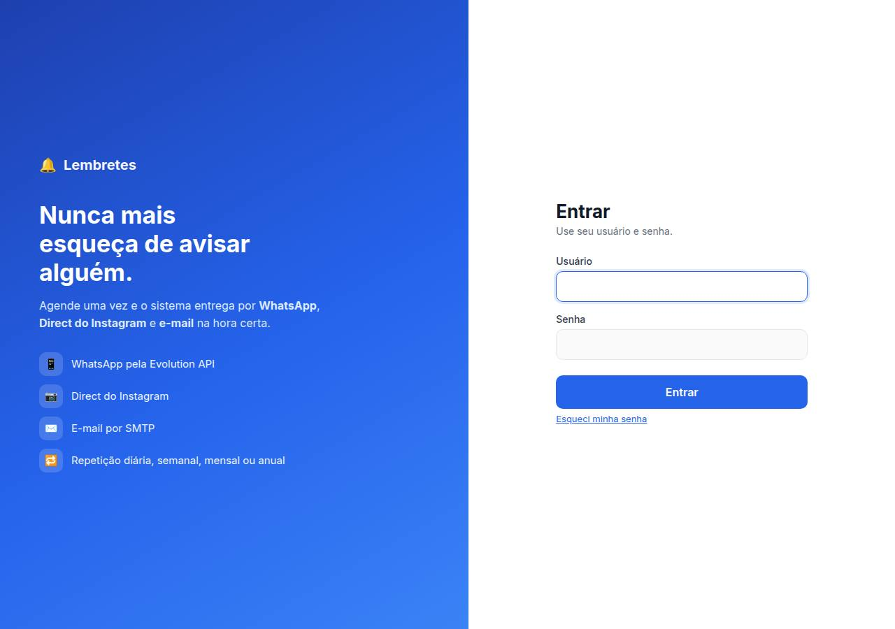
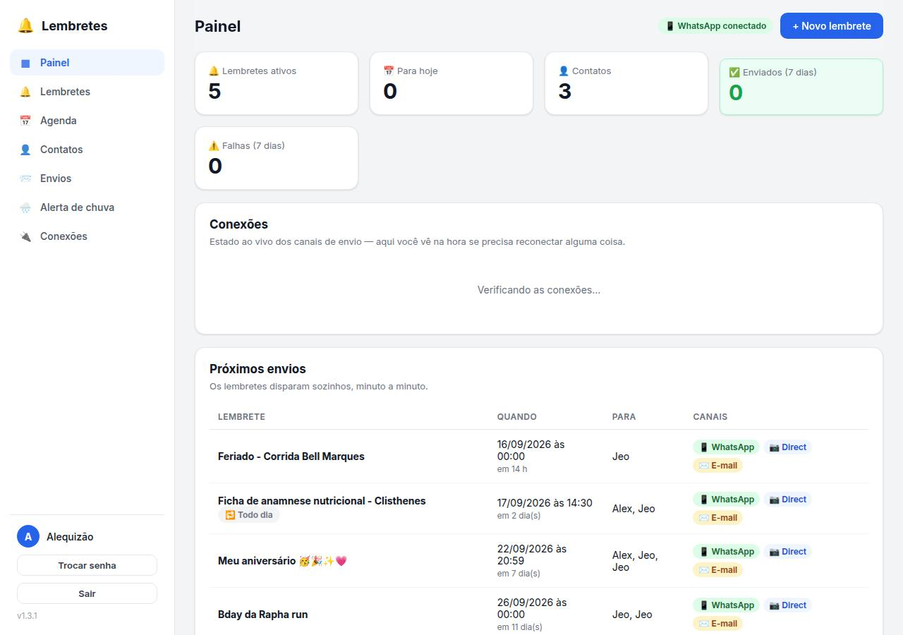
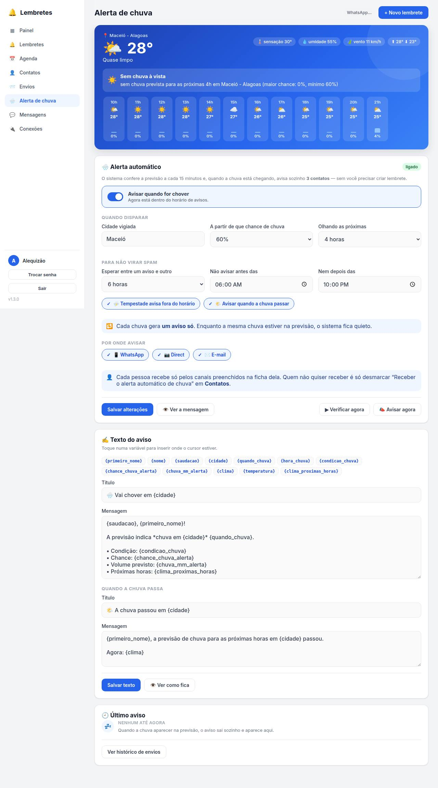
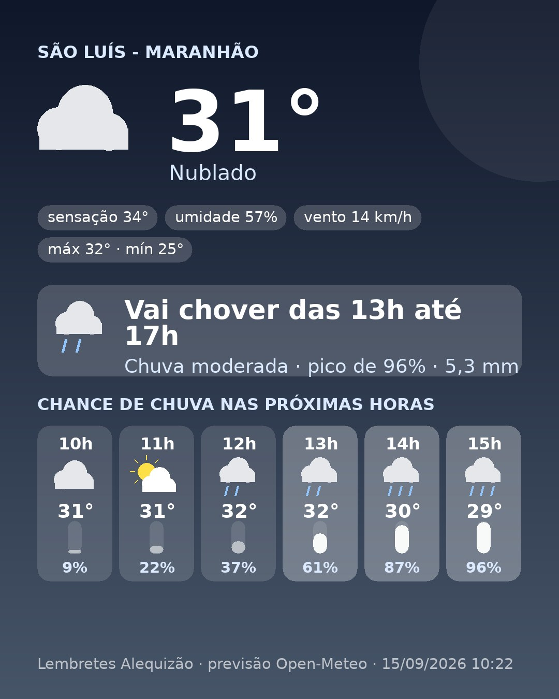
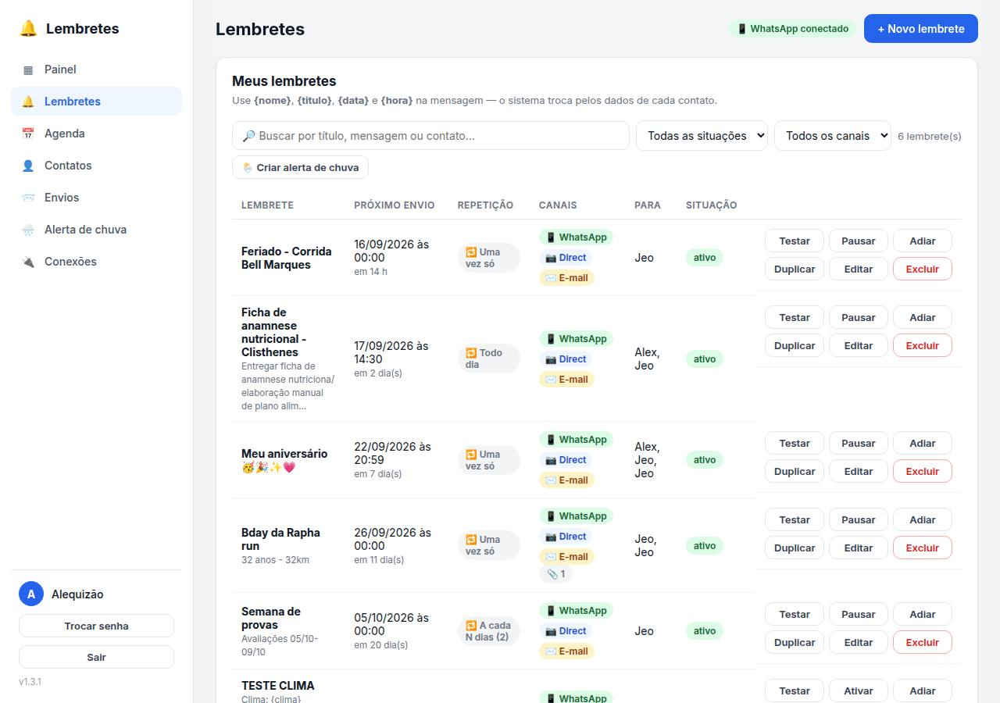
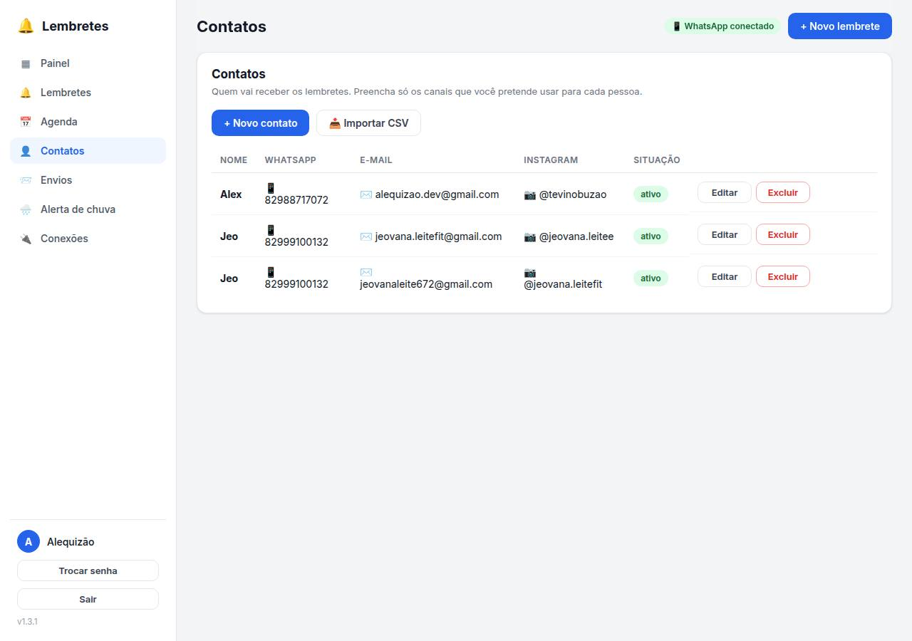
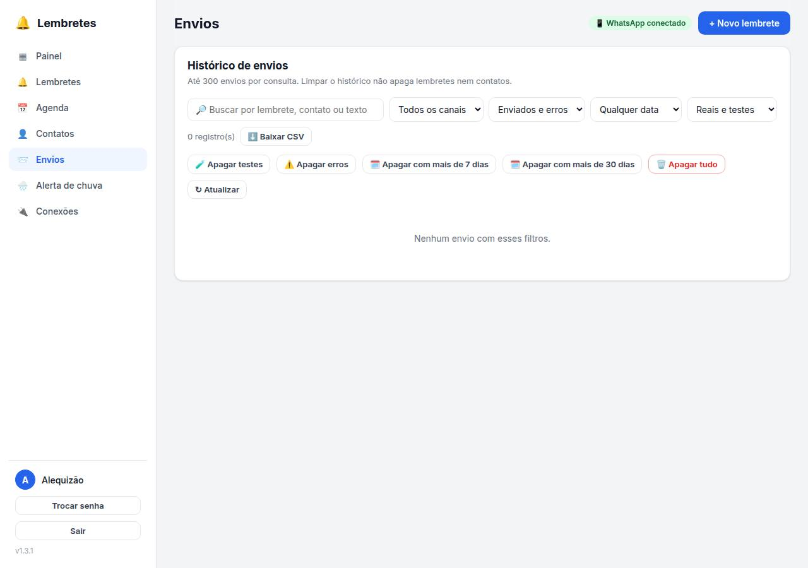
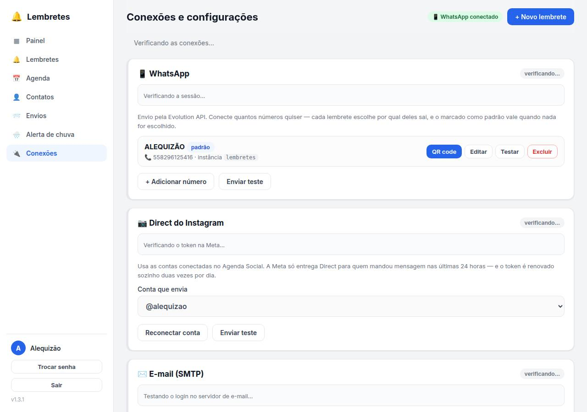
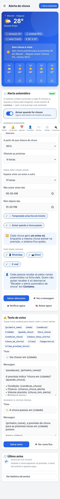

# 🔔 Lembretes — avise quem importa, na hora certa

Sistema de lembretes automáticos que entrega por **WhatsApp**, **Direct do Instagram** e **e-mail**.
Você agenda uma vez; o servidor cuida do resto — repetição, anexos, variáveis na mensagem, tentativas
quando falha e um **alerta automático de chuva** que avisa sozinho quando a previsão muda.

Feito em PHP 8.3 + MySQL, sem framework e sem dependência externa (o cliente SMTP é próprio e as
imagens são geradas com GD).

## 📸 Telas do sistema

| Login | Painel |
|:---:|:---:|
|  |  |

| Alerta de chuva | Cartão que vai junto no aviso |
|:---:|:---:|
|  |  |

<details>
<summary>Mais telas</summary>

| Lembretes | Contatos |
|:---:|:---:|
|  |  |

| Envios | Conexões |
|:---:|:---:|
|  |  |

| No celular |
|:---:|
|  |

</details>

## ✨ O que ele faz

- **Três canais**: WhatsApp (Evolution API), Direct do Instagram (Graph API) e e-mail (SMTP próprio, com modelo HTML responsivo).
- **Repetição**: uma vez, de hora em hora, diária, semanal, quinzenal, mensal, anual ou a cada N dias, com data para parar.
- **Aviso antecipado**: "faltam 2 horas para…" antes do horário marcado.
- **31 variáveis** na mensagem — `{primeiro_nome}`, `{saudacao}`, `{data_extenso}`, `{clima}`, `{temperatura}` e companhia — com prévia antes de salvar.
- **Anexos** de até 16 MB: imagem, vídeo, áudio e documento, com o tratamento certo em cada canal.
- **Vários números de WhatsApp**: cada lembrete escolhe por qual número sai.
- **Condições de clima**: "só envie se a chance de chuva passar de 60%", "se a temperatura passar de 33°"…
- **Alerta automático de chuva** (abaixo).
- **Painel de conexões** com diagnóstico ao vivo dos três canais, renovação automática do token do Instagram e histórico de envios com reenvio.

## 🌧️ Alerta automático de chuva

Um cron confere a previsão a cada 15 minutos (fonte: [Open-Meteo](https://open-meteo.com), sem chave)
e avisa sozinho quando a chuva está chegando:

- dispara a partir da chance que você escolher, olhando as próximas N horas;
- calcula a **janela** ("vai chover das 13h até 17h") e a **intensidade** (fraca, moderada, forte, tempestade);
- **um aviso por chuva** — com intervalo mínimo entre avisos e janela de silêncio noturno (tempestade pode furar);
- **reavisa se piorar** (chance sobe 25 pontos ou vira tempestade);
- avisa de novo quando a chuva **passa**;
- **cada contato recebe a previsão da cidade dele** (campo cidade na ficha; sem isso, vale a cidade padrão);
- manda junto um **cartão da previsão em imagem**, gerado com GD — no WhatsApp como legenda, no Direct em seguida ao texto, no e-mail anexado.

## 🧱 Stack e arquivos

| Arquivo | Papel |
|---|---|
| `index.php` | shell da SPA + tela de login |
| `app.js` / `style.css` | interface inteira (roteador por hash, sem framework) |
| `api.php` | API JSON (`?acao=…`) |
| `lib.php` | banco, sessão, variáveis das mensagens |
| `canais.php` | envio por WhatsApp, Direct e SMTP (cliente escrito à mão) |
| `agenda.php` / `cron.php` | regras de repetição e processamento da fila |
| `clima.php` | previsão do tempo (API pública própria sobre o Open-Meteo) |
| `alertachuva.php` | alerta automático de chuva |
| `climaimagem.php` / `clima-cartao.php` | cartão da previsão em imagem (GD) |
| `midias.php` / `midias` | anexos |
| `mensagens.php` | caixa de mensagens recebidas (WhatsApp/Direct) |
| `install.php` | cria e migra o banco (idempotente, só CLI) |

## 🚀 Instalação

```bash
cp config.example.php config.php     # preencha banco, endereço, Evolution API e SMTP
php install.php                      # cria as tabelas e o administrador
```

O `install.php` é idempotente (pode rodar de novo a cada atualização) e, na primeira vez,
cria o administrador com **senha sorteada, mostrada uma única vez no terminal**. Para escolher
o login e a senha: `ADMIN_USUARIO=chefe ADMIN_SENHA=... php install.php`.

Crons sugeridos:

```cron
* * * * *  php /caminho/lembretes/cron.php           >> /var/log/lembretes.log 2>&1
*/15 * * * * php /caminho/lembretes/alertachuva.php  >> /var/log/lembretes-chuva.log 2>&1
15 4,16 * * * php /caminho/lembretes/renovar_ig.php  >> /var/log/lembretes-ig-token.log 2>&1
```

Requisitos: PHP 8.1+ (PDO, cURL, GD, mbstring), MySQL 5.7+ e, para o WhatsApp, uma instância da
[Evolution API](https://github.com/EvolutionAPI/evolution-api).

> ⚠️ Em servidores com **PHP-FPM** não use `php_flag` no `.htaccess` (derruba com HTTP 500) —
> a pasta `uploads/` se protege com `<FilesMatch>` + `Options -ExecCGI`.

## 👨‍💻 Desenvolvedor

Sistema desenvolvido sob medida por **Alequizao**.

- **E-mail:** alequizao.dev@gmail.com
- **GitHub:** [@alequizao](https://github.com/alequizao)

Quer um sistema como este para o seu negócio? Entre em contato.

---

© Alequizão · Todos os direitos reservados.
O código está público para consulta e portfólio; uso comercial, cópia ou
redistribuição somente com autorização.
